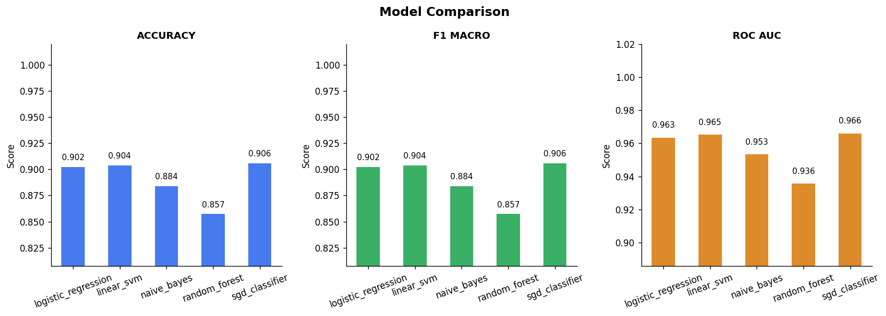
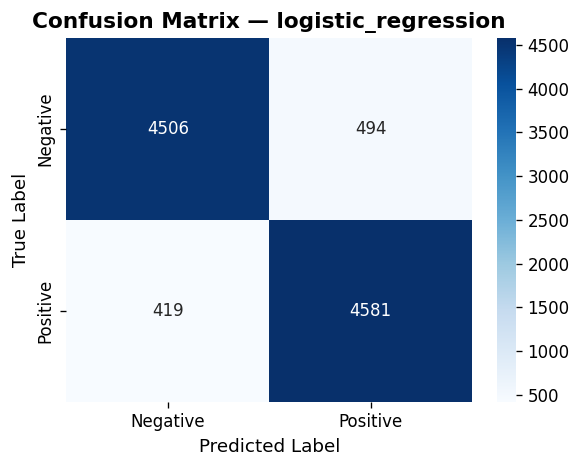
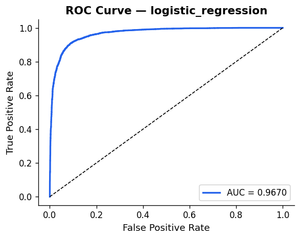
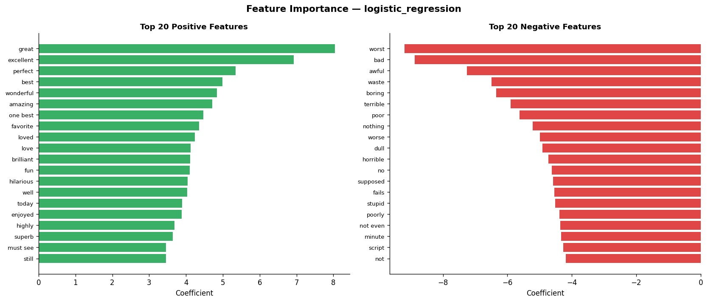

# 🎬 Sentiment Analysis — NLP & Machine Learning Pipeline

A production-grade **movie review sentiment classifier** built from scratch using classical NLP and scikit-learn. Trained on the IMDB dataset (50,000 reviews), it achieves **90.6% accuracy** and **0.966 ROC-AUC** with a live Flask web interface.

---

## 📸 Screenshots

| Web App | Model Comparison |
|---|---|
|  |  |

| Confusion Matrix | ROC Curve | Feature Importance |
|---|---|---|
|  |  |  |

---

## 🏆 Results

| Model | Accuracy | F1 (Macro) | ROC-AUC |
|---|---|---|---|
| SGD Classifier | **90.6%** | **0.906** | **0.966** |
| Linear SVM | 90.4% | 0.904 | 0.965 |
| Logistic Regression | 90.2% | 0.902 | 0.963 |
| Naive Bayes | 88.4% | 0.884 | 0.953 |
| Random Forest | 85.7% | 0.857 | 0.936 |

---

## 🗂️ Project Structure

```
sentiment-analysis/
│
├── src/
│   ├── __init__.py             # Package exports
│   ├── data_loader.py          # CSV loading + train/val/test split
│   ├── preprocessor.py         # Text cleaning pipeline (HTML, contractions, lemmatize)
│   ├── feature_engineering.py  # TF-IDF / BoW vectorizers
│   ├── models.py               # Model registry + GridSearchCV tuner
│   ├── evaluator.py            # Metrics, confusion matrix, ROC, feature plots
│   └── predictor.py            # Serializable inference pipeline
│
├── templates/
│   └── index.html              # Flask frontend
│
├── data/                       # Place dataset here (not committed)
├── outputs/                    # Saved models + plots (not committed)
│
├── main.py                     # Training orchestrator (CLI)
├── predict.py                  # Inference CLI
├── App.py                      # Flask web server
├── convert.py                  # IMDB CSV label converter
└── requirements.txt
```

---

## ⚙️ Setup & Installation

```bash
# 1. Clone the repository
git clone https://github.com/<your-username>/sentiment-analysis.git
cd sentiment-analysis

# 2. Create a virtual environment
python -m venv venv
source venv/bin/activate        # Windows: venv\Scripts\activate

# 3. Install dependencies
pip install -r requirements.txt
```

---

## 📦 Dataset

Download the [IMDB Dataset](https://www.kaggle.com/datasets/lakshmi25npathi/imdb-dataset-of-50k-movie-reviews) from Kaggle and place it in the `data/` folder.

Then convert labels:
```bash
python convert.py
```
This maps `positive → 1` and `negative → 0` and saves `data/IMDB_clean.csv`.

---

## 🚀 Training

```bash
# Train with default Logistic Regression
python main.py --csv data/IMDB_clean.csv --text_col review --label_col sentiment

# Train a specific model
python main.py --csv data/IMDB_clean.csv --text_col review --label_col sentiment --model sgd_classifier

# Benchmark ALL models
python main.py --csv data/IMDB_clean.csv --text_col review --label_col sentiment --compare

# Hyperparameter tuning
python main.py --csv data/IMDB_clean.csv --text_col review --label_col sentiment --model logistic_regression --tune
```

Available models: `logistic_regression`, `linear_svm`, `naive_bayes`, `random_forest`, `sgd_classifier`

Available strategies: `tfidf_word`, `tfidf_char`, `tfidf_combo`, `bow`

---

## 🔍 Inference

```bash
# Single prediction
python predict.py --model outputs/sentiment_pipeline_logistic_regression.joblib \
                  --text "The film was absolutely brilliant!"

# Batch from file (one review per line)
python predict.py --model outputs/sentiment_pipeline_logistic_regression.joblib \
                  --file data/new_reviews.txt

# Interactive CLI demo
python predict.py --model outputs/sentiment_pipeline_logistic_regression.joblib
```

---

## 🌐 Web Application

```bash
python App.py
```

Navigate to `http://127.0.0.1:5000` — type any review and get an instant sentiment prediction with confidence score. The dashboard also shows a live model comparison chart.

---

## 🔬 NLP Pipeline

```
Raw Text
  ↓ Lowercase + HTML removal
  ↓ Contraction expansion (can't → cannot)
  ↓ Special character removal
  ↓ Tokenization (NLTK punkt)
  ↓ Stopword removal (preserving negations: not, never, no)
  ↓ Lemmatization (WordNet)
  ↓ TF-IDF Vectorization (word unigrams + bigrams, 50k features)
  ↓ Classifier (Logistic Regression / SVM / NB / RF / SGD)
  ↓ Sentiment Label + Confidence Score
```

Key design decisions:
- **Negation words preserved** (`not`, `never`, `no`) — critical for sentiment
- **Sublinear TF scaling** (`log(1+tf)`) — prevents high-frequency term dominance
- **ComplementNB** over MultinomialNB — better on balanced datasets
- **CalibratedClassifierCV** wraps LinearSVC — enables probability outputs

---

## 📊 Visualizations Generated

After training, the following plots are saved to `outputs/`:

- `confusion_matrix_<model>.png` — heatmap of predictions vs. ground truth
- `roc_curve_<model>.png` — ROC curve with AUC annotation
- `feature_importance_<model>.png` — top 20 positive & negative TF-IDF features
- `model_comparison.png` — bar chart comparing all models across metrics

---

## 🛠️ Tech Stack

| Layer | Technology |
|---|---|
| Language | Python 3.10+ |
| ML Framework | scikit-learn |
| NLP | NLTK (tokenization, lemmatization, stopwords) |
| Feature Extraction | TF-IDF (word + char n-grams), Bag-of-Words |
| Web Framework | Flask |
| Visualization | Matplotlib, Seaborn, Chart.js |
| Serialization | joblib |
| Dataset | IMDB 50K Movie Reviews |

---

## 📁 .gitignore Notes

The following are excluded from version control:
- `data/` — raw dataset files (download from Kaggle)
- `outputs/` — trained model `.joblib` files and generated plots
- `venv/` — virtual environment

---

## 🤝 Contributing

Pull requests are welcome. For major changes, please open an issue first.

---

## 📄 License

[MIT](LICENSE)

---

*Built with ❤️ as part of an AI/ML learning journey.*
